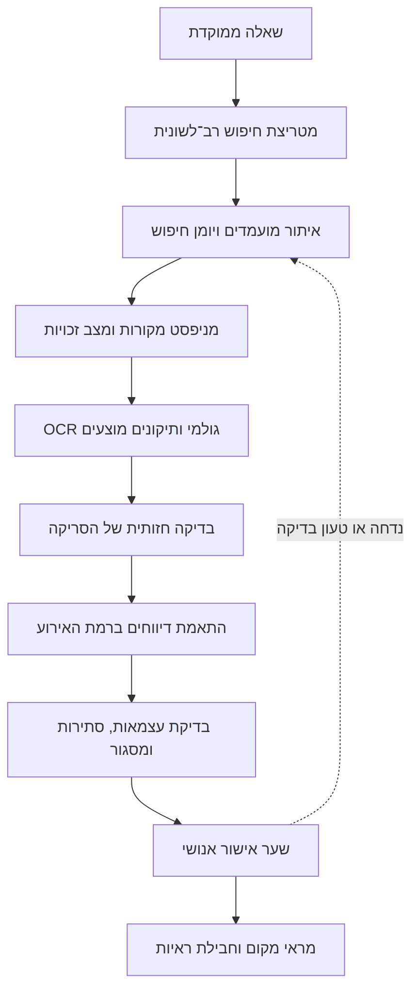

# מאותה ידיעה לשתי היסטוריות: בניית סוכן לחקר עיתונות היסטורית

ב־11 ביולי 1938, ליד הכפר דבוריה, נתקל כוח של חיילים בריטים ונוטרים יהודים בקבוצה ערבית חמושה. למחרת הופיע הקרב בעיתונים בעברית ובערבית. הפרטים הבסיסיים חזרו בכמה מהם: לפחות שלושה מאנשי הקבוצה נהרגו, נוטר יהודי נהרג, וקפטן אורד וינגייט וחיילים ונוטרים נוספים נפצעו. אבל הקוראים לא קיבלו אותו סיפור.

*הארץ* הציב את הידיעה בעמוד הראשון, בתוך מקבץ שכותרתו "נחשול הטרור בכל חלקי הארץ". *דבר* פרסם באותו עמוד ידיעה קצרה תחת הכותרת "קרב עם כנופיה גדולה", לצד ידיעה על הלווייתו של הנוטר יוסף בן־משה, והרחיב על הקרב בתוספת הערב. בעיתון הערבי *פלסטין* הופיע "תיאור קרב דבוריה" בתוך כותרת רחבה על נפגעים ואלימות. הדיווח הערבי המשיך מן הקרב אל מה שאירע אחריו: כוח גדול נכנס לכפר, כיתר אותו וחיפש בבתים. שלושה עיתונים דיווחו על אירוע אחד. כל אחד בחר נקודת תצפית אחרת.[^1]

| כותר | תאריך ומיקום | כותרת או תיאור מאומת | מקור המידע | מעמד האימות |
|---|---|---|---|---|
| *הארץ* | 12 ביולי 1938, עמ' 1 | "נחשול הטרור בכל חלקי הארץ" | לשכת המודיעין הממשלתית | הסריקה נבדקה |
| *דבר* | 12 ביולי 1938, עמ' 1 ותוספת הערב | "קרב עם כנופיה גדולה" | מקור רשמי משותף הוא אפשרות סבירה, לא מוכחת | הסריקה נבדקה |
| *פלסטין* | 12 ביולי 1938, ידיעות 5 ו־19 | "תיאור קרב דבוריה" והמשך הדיווח | דיווח עיתונאי וקומוניקט רשמי | הסריקה והרשומות נבדקו |

*איור 1. שלושה כרטיסי מקור לאותו אירוע. הכותרות, מקורות המידע ומצב האימות נשמרים בנפרד; שלושה עיתונים אינם בהכרח שלוש עדויות עצמאיות. הטבלה מחליפה בפוסט הציבורי את סריקות העיתונים, שאינן מופצות ללא בירור זכויות.*

כשהתחלתי לחפש את תמונת הראי הערבית של פלוגות השדה ופלגות הלילה המיוחדות, חיפשתי תחילה את שמות היחידות. זו הייתה נקודת פתיחה הגיונית, והיא כמעט לא הניבה דבר. הביטויים הערביים המקבילים לא הופיעו בתוצאות הרלוונטיות. שמו של וינגייט הופיע רק לאחר שניסיתי כמה כתיבים. החיפוש השתנה כאשר חדלתי לשאול כיצד נקראה היחידה והתחלתי לשאול מה קרה: היכן התרחש האירוע, מתי, מי השתתף בו, מי נפגע ומה עשה הכוח לאחר הקרב. החיפוש אחר דבוריה החזיר שמונה עשרה תוצאות לשנת 1938. שתיים מהן הובילו אל האירוע.[^2]

כאן נולד הסוכן. לא ביקשתי ממנו לכתוב היסטוריה במקומי. ביקשתי ממנו לזכור כל שאילתה, להציע חלופות בין עברית לערבית, להפריד בין OCR לבין מה שנראה בעמוד, ולקשור יחד דיווחים רק כאשר התאריך, המקום ולפחות שני פרטים נוספים התאימו. דבוריה הפכה ממילת חיפוש למבחן של שיטה. השאלה כבר לא הייתה רק מה דיווח כל עיתון. השאלה הייתה כיצד אפשר לשחזר, לבדוק ולתקן את הדרך שהובילה מן הארכיון אל הטענה ההיסטורית.

## 1. ממחסור בגישה לעודף מידע {#ממחסור-בגישה-לעודף-מידע}

לפני מהפכת המידע, המחסור התחיל עוד לפני הקריאה. החוקר היה צריך לדעת היכן שמור העיתון, להגיע לספרייה או לארכיון, להזמין כרכים או לגלול מיקרופילם, לצלם או לסרוק את הגיליונות המתאימים ולשוב אליהם לאחר מכן. גם כאשר המיקרופילם חסך נסיעה לארכיון המקורי, העבודה נותרה סדרתית: עמוד אחר עמוד. מאגרי OCR וצילום דיגיטלי שינו את סדר העבודה. היום אפשר לחפש מאות שנים ואלפי עמודים בתוך דקות, ולעיתים למצוא מידע בלי לדעת מראש באיזה אוסף הוא חבוי.[^3]

הגישה נעשתה קלה יותר, אך צוואר הבקבוק עבר מקום. עבודה יסודית עדיין דורשת שעות רבות. עודף המקורות מחייב את החוקר לבחור שאילתה, להבחין בין התאמה מקרית לידיעה רלוונטית, לבדוק OCR מול העמוד, לשמור את ההקשר ולברר אם שני דיווחים נשענים על אותו קומוניקט. ארכיון עיתונות דיגיטלי אינו עותק שקוף של העיתון. הוא מסד נתונים סלקטיבי, המושפע מבחירת הכותרים, מאיכות הסריקה, ממנוע החיפוש ומטעויות זיהוי התווים. מחקר על מאגרי עיתונות מצא ששגיאות כאלה עלולות להשמיט חלק ניכר מן המופעים המבוקשים.[^4]

כאן הבינה המלאכותית יכולה למנוע מאתנו לטבוע במידע. כבר עכשיו סוכן יכול להציע וריאציות רב־לשוניות, לאתר מקורות, לחפש בתוכם, למיין מועמדים, לייבא באיכות הזמינה את הקבצים שהארכיון מתיר, לשמור מטא־דאטה וקישורים, להשוות דיווחים ולזהות הסכמות וסתירות. בעתיד הוא עשוי לקרוא עמודים רב־לשוניים בדיוק גבוה יותר ולקשר בין גרסאות רחוקות של אותו אירוע. אבל הוא אינו קובע את איכות הסריקה ואינו מעניק זכויות שימוש. אלה נשארות בידי הארכיון ובעלי הזכויות. הוא גם אינו מחליף את הקריאה. תרומתו היא לצמצם את המרחב שבו הקריאה האנושית צריכה להיות מדויקת.

## 2. מחמש שאלות לשחזור אירוע {#מחמש-שאלות-לשחזור-אירוע}

לא ניסיתי לסרוק את הארכיון כולו. התחלתי בפיילוט עברי בן חמש שאלות. הראשונה בדקה כיצד תיארה העיתונות את וינגייט בזמן אמת. השנייה ביררה אילו שמות שימשו בעברית לפלוגות הלילה המיוחדות. השלישית עסקה בקשר בינו לבין יצחק שדה. השתיים האחרונות בדקו מתי הופיעו המונחים "הנודדות" והפו״ש, וכיצד תואר המעבר מהגנה פסיבית לפעולה התקפית. התחימה אפשרה לבדוק אילו משפחות חיפוש עובדות, היכן ה־OCR מטעה ואיזה תיעוד דרוש כדי שחוקר אחר יוכל לשחזר את הדרך.

בחיפוש תמונת הראי הערבית ניסיתי תחילה לתרגם את שמות היחידות. השאילתות `الفرق الليلية` ו־`فصائل الميدان` לא החזירו התאמות. גם שלושה כתיבים אחרים שנבדקו לשמו של וינגייט לא הניבו דבר. היומן שמר גם את הכישלונות האלה. אחר כך הרחבתי את המטריצה: שמות וכתיבים חלופיים, מקומות כגון חניתה ודבוריה, תשתיות כמו צינור הנפט, ופעולות ותוצאות כגון סיור, מארב, ירי, נפגעים, כיתור וחיפוש. הכתיב `ونجيت` העלה שתי תוצאות, והצירוף `الكابتن ونجيت` הוביל ישירות לדיווח על דבוריה.[^5]

מרגע שנמצאו דיווחים, לא חיברתי ביניהם בשל מילה משותפת. שני מקורות הוגדרו כמתארים אותו אירוע רק כאשר התאריך והמקום חפפו ולפחות שני מאפיינים נוספים התאימו. בדבוריה היו אלה הכוח הבריטי־יהודי המעורב, פציעת וינגייט, מאזן הנפגעים והפעולה בכפר לאחר הקרב. כלל זה גם השאיר התאמות אחרות במעמד "סביר" כאשר פרט מכריע נותר חסר. כך נעשה האירוע ליחידת ההשוואה. מילת המפתח נשארה אמצעי ניווט.

## 3. בין העמוד לטענה {#בין-העמוד-לטענה}

החיפוש יצר מועמדים, לא ראיות. לכל רשומה שמרתי שרשרת בת שש שכבות. הראשונה היא המטא־דאטה שסיפק הארכיון: עיתון, תאריך וקישור. השנייה היא ה־OCR הגולמי שהפיקה המכונה. השלישית היא תמלול שקראתי מן הסריקה. הרביעית היא נרמול זהיר של כתיב או כותרת משובשת. החמישית היא תרגום. רק השכבה השישית מכילה את ההיסק המחקרי. אלה אינן שש גרסאות מתחרות של אותו טקסט. הן תחנות שונות בדרך ממנו אל הטענה. ההפרדה מראה מה סיפק הארכיון, מה ניחשה המכונה, מה קרא החוקר ומה הסיק.

אותה שקיפות נדרשת גם כלפי המאגר. אוסף דיגיטלי הוא מבחר מתוך העיתונות שנשמרה, ורשימת תוצאות היא מבחר נוסף שיצרו השאילתה ואיכות ה־OCR. מחקרים על הטיות באוספים, על תהליכי עבודה בין־תחומיים ועל ממשקי Impresso מתכנסים סביב דרישה אחת: לחשוף את הרכב האוסף, את מקור הנתונים, את שלבי העיבוד ואת איכותם.[^6]

דבוריה חשפה בעיה נוספת. ב־*הארץ* יוחסו פרטי הקרב ללשכת המודיעין הממשלתית. הדמיון בפרטים ובמספרי הנפגעים ב־*דבר* הופך מקור רשמי משותף לאפשרות סבירה, שעדיין אינה מוכחת במלואה. *פלסטין* שילב את ליבת ההודעה הרשמית עם מידע נוסף על כיתור הכפר והחיפוש בבתים. שלושה כותרים יצרו אפוא שלושה מסגורים, אך לא בהכרח שלוש עדויות עצמאיות. לכן ספרתי בנפרד כותרים, מקורות מידע ונקודות מבט. אותו קומוניקט אינו אישור שלישי לעובדות. הוא ראיה לאופן שבו כל מערכת בחרה למקם, להרחיב ולמסגר אותן.[^7]

## 4. מן הפיילוט לסקיל {#מן-הפיילוט-לסקיל}

לאחר הפיילוט הפכתי את סדר הפעולות לסקיל: חבילת הוראות ותבניות שאפשר להפעיל מחדש על שאלה אחרת. הקלט מצומצם: שאלה ממוקדת, טווח תאריכים, שפות ונקודות מבט. מכאן הסוכן בונה מטריצת חיפוש, מריץ וריאציות ושומר כל שאילתה ביומן, לרבות תוצאות אפס. כל מועמד מקבל מזהה ונרשם במניפסט מקורות, שהוא מלאי מתועד של כתבות, קישורים, מצב אימות ומגבלות זכויות. טבלת הצלבת אירועים בודקת אילו דיווחים עוסקים באותו מקרה ומה מידת התלות ביניהם. רק לאחר מכן מגיע המועמד לשער האישור האנושי.

*איור 2. מן השאלה אל חבילת הראיות. החץ החוזר מציג מועמד שאינו עובר את שער האישור; הוא נשמר ביומן וחוזר לבדיקה במקום להיעלם מן התיעוד.*

מודל השפה נכנס לתהליך כעוזר, לא כעותק מוסמך של העיתון. הוא יכול להציע תיקוני OCR, אך אסור לו למחוק את הפלט הגולמי או להחליף את הסריקה. הסיבה אינה תאורטית בלבד. במחקר על עיתונות ספרדית מאמריקה הלטינית סווגו כ־78 אחוז מן השינויים שהציע המודל כהזיות, ורק כ־12 אחוז כתיקוני OCR ממשיים. התוצאה שייכת למסגרת שנבדקה שם, אך האזהרה רחבה יותר: תיקון מכונה הוא השערה שיש לבדוק.[^8]

אותו כלל חל על קידוד. המודל יכול להציע אם דיווח נשען על קומוניקט, כתב מקומי או עיבוד מערכתי, ולסייע במיון מועמדים לפי רלוונטיות. אבל הקטגוריות צריכות להיקבע בידי החוקר ולהיבדק מול מדגם שקודד בידי אדם. מחקר עדכני בקידוד איכותני מדגים את הסדר הזה; ASReview, כלי לסינון ספרות בעזרת למידה פעילה, מציע אנלוגיה משלימה, שבה האלגוריתם מתעדף את הרשומות אך החוקר מחליט מה לכלול ומתי לעצור. הסקיל אינו מיישם את שתי השיטות במלואן. הוא מאמץ את חלוקת העבודה ביניהן: המכונה מקצרת את התור ושומרת את עקבות ההחלטה; החוקר מאמת, מפרש ומצטט.[^9]

## 5. מה השיטה מוסיפה {#מה-השיטה-מוסיפה}

התרומה אינה אלגוריתם חדש. היא חיבור קל ונגיש לחוקר יחיד בין פעולות שכבר מוכרות בכמה קהילות מחקר: חיפוש רב־לשוני, ביקורת על גבולות האוסף, תעדוף מועמדים, קידוד בסיוע מודל ובדיקת מקור. החיבור נעשה סביב אירוע היסטורי ומפיק תיק ראיות שאפשר לבדוק, להעביר לחוקר אחר ולתקן. הוא מתאים במיוחד לשאלות שבהן קבוצות יריבות תיארו אותו מעשה במונחים שונים.

לשיטה יש גבולות. הארכיון הדיגיטלי אינו העיתונות כולה, ה־OCR עלול להסתיר ידיעה רלוונטית, וידע בערבית ובעברית נותר חיוני לבדיקת שמות, הקשר ומשמעות. גם מקור שאותר ואומת אינו בהכרח עצמאי ממקורות אחרים. מגבלות גישה וזכויות קובעות מה אפשר לשמור ומה אפשר לפרסם. משום כך הסקיל אינו טוען למיצוי. הוא משאיר פערים גלויים ורושם איזו בדיקה נדרשת כדי לצמצם אותם.

במקרה דבוריה, הסוכן לא פתר את השאלה ההיסטורית. הוא הפך את הדרך אל התשובה לגלויה, ניתנת לבדיקה וניתנת לתיקון.

## הערות ומקורות

[^1]: "Nehshol ha-teror be-khol helkei ha-arets" [A Wave of Terror throughout the Country], *Haaretz*, July 12, 1938, 1 [in Hebrew]; "Krav im knufya gedola" [Battle with a Large Gang], *Davar*, July 12, 1938, 1, and the expanded report in the evening supplement, 2 [in Hebrew]; “Waṣf maʿrakat Dabbūriyya” [Description of the Battle of Dabburiya], in “Qatl yahūdiyyayn ...” [Two Jews Killed ...], *Filasṭīn*, July 12, 1938, https://www.nli.org.il/he/newspapers/?a=d&d=falastin19380712-01.2.5; continuation at https://www.nli.org.il/he/newspapers/?a=d&d=falastin19380712-01.2.19 [in Arabic]. דיווחי העיתונים משלבים מידע מקומי והודעה רשמית, ולכן אין לראות בשלושת הכותרים שלוש עדויות עצמאיות.

[^2]: יומן החיפוש של פיילוט העיתונות הערבית, 31 ביולי 2026, שאילתות `"الفرق الليلية"`, `"فصائل الميدان"`, `ونجيت`, `"الكابتن ونجيت"` ו־`"دبورية"`; תוצאות החיפוש נשמרו כחלק מחבילת המחקר. תוצאת אפס מתעדת את ביצוע השאילתה, לא את היעדר המונח מן העיתונות כולה.

[^3]: Ian Milligan, *The Transformation of Historical Research in the Digital Age* (Cambridge: Cambridge University Press, 2022), 14–15, https://doi.org/10.1017/9781009026055; Lara Putnam, “The Transnational and the Text-Searchable: Digitized Sources and the Shadows They Cast,” *American Historical Review* 121, no. 2 (April 2016): 377–78, https://doi.org/10.1093/ahr/121.2.377.

[^4]: Bob Nicholson, “The Digital Turn: Exploring the Methodological Possibilities of Digital Newspaper Archives,” *Media History* 19, no. 1 (2013): 59–61, https://doi.org/10.1080/13688804.2012.752963; Jørgen Burchardt, “Are Searches in OCR-Generated Archives Trustworthy? An Analysis of Digital Newspaper Archives,” *Jahrbuch für Wirtschaftsgeschichte / Economic History Yearbook* 64, no. 1 (2023): 31–32, https://doi.org/10.1515/jbwg-2023-0003.

[^5]: יומני החיפוש של פיילוט העיתונות העברית ושל פיילוט תמונת הראי הערבית, 31 ביולי 2026; מניפסט המקורות וטבלת התאמת האירועים הנלווים. החומרים נשמרו בחבילת המחקר. תוצאה שלילית ביומן מתעדת את ביצוע השאילתה בגבולות המאגר והטווח שנבדקו; אין היא מוכיחה שהמונח או האירוע נעדרו מן העיתונות.

[^6]: Kaspar Beelen et al., “Bias and Representativeness in Digitized Newspaper Collections: Introducing the Environmental Scan,” *Digital Scholarship in the Humanities* 38, no. 1 (April 2023): 1–5, https://doi.org/10.1093/llc/fqac037; Sarah Oberbichler et al., “Integrated Interdisciplinary Workflows for Research on Historical Newspapers: Perspectives from Humanities Scholars, Computer Scientists, and Librarians,” *Journal of the Association for Information Science and Technology* 73, no. 2 (February 2022): 225–39, https://doi.org/10.1002/asi.24565; Marten Düring, Estelle Bunout, and Daniele Guido, “Transparent Generosity: Introducing the Impresso Interface for the Exploration of Semantically Enriched Historical Newspapers,” *Historical Methods* 57, no. 1 (2024): 20–24, https://doi.org/10.1080/01615440.2024.2344004.

[^7]: “Nehshol ha-teror be-khol helkei ha-arets,” 1; “Krav im knufya gedola,” 1; “Waṣf maʿrakat Dabbūriyya.” הערכת התלות נשענת על ייחוס מפורש ב־*הארץ*, על הדמיון בין הדיווחים העבריים ועל סיווג מקור המידע ב־*פלסטין* כמשולב; היא אינה קביעה כי נוסח זהה הועתק בשלושת העיתונים.

[^8]: Laura Manrique-Gomez et al., “Historical Ink: 19th Century Latin American Spanish Newspaper Corpus with LLM OCR Correction,” in *Proceedings of the 4th International Conference on Natural Language Processing for Digital Humanities* (Miami: Association for Computational Linguistics, 2024), 134–36, https://doi.org/10.18653/v1/2024.nlp4dh-1.13.

[^9]: Zackary Okun Dunivin, “Scaling Hermeneutics: A Guide to Qualitative Coding with LLMs for Reflexive Content Analysis,” *EPJ Data Science* 14 (2025): article 28, secs. 1.3–4, https://doi.org/10.1140/epjds/s13688-025-00548-8; Rens van de Schoot et al., “An Open Source Machine Learning Framework for Efficient and Transparent Systematic Reviews,” *Nature Machine Intelligence* 3 (2021): 125–27, https://doi.org/10.1038/s42256-020-00287-7.
