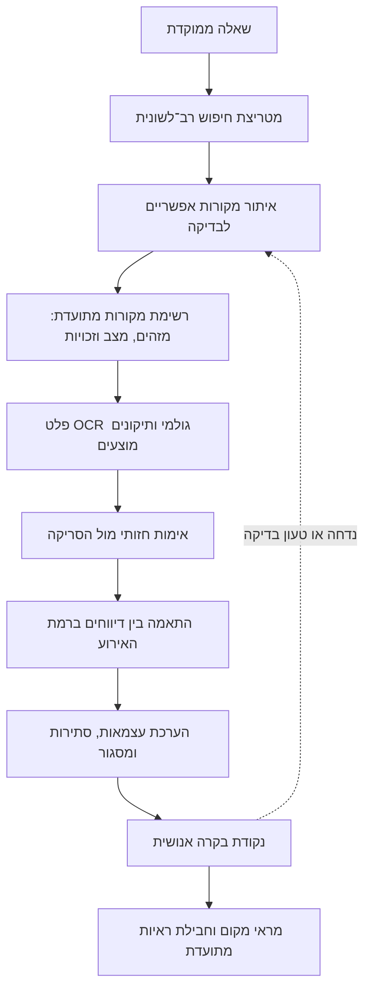

# מידיעה אחת לשתי היסטוריות: בניית סוכן למחקר בעיתונות היסטורית

ב־11 ביולי 1938 כוח של חיילים בריטים ונוטרים יהודים נתקל ליד הכפר דבוריה בקבוצה ערבית חמושה. למחרת דיווחו על הקרב עיתונים בעברית ובערבית. הפרטים הבסיסיים חזרו בכמה מן הדיווחים: לפחות שלושה מאנשי הקבוצה החמושה נהרגו, נוטר יהודי אחד נהרג, וקפטן אורד וינגייט וכן כמה חיילים ונוטרים נפצעו. ובכל זאת, הקוראים קיבלו דיווחים שונים על האירוע.

שלושת העיתונים הציגו את אותו אירוע בדרכים שונות. *הארץ* הציב את הידיעה בעמוד הראשון, בתוך מקבץ שכותרתו "נחשול הטרור בכל חלקי הארץ". *דבר* פרסם בעמוד הראשון ידיעה קצרה שכותרתה "קרב עם כנופיה גדולה", לצד ידיעה על הלווייתו של הנוטר יוסף בן־משה, ובתוספת הערב הרחיב את תיאור הקרב. העיתון הערבי *פלסטין* כלל את "תיאור קרב דבוריה" תחת כותרת רחבה על נפגעים ואלימות. הדיווח הערבי לא הסתיים בקרב: הוא תיאר גם כוח גדול שנכנס לכפר, כיתר אותו וחיפש בבתים. מדובר בשלושה עיתונים ובשלוש דרכי מסגור, אך לא בהכרח בשלושה דיווחים עצמאיים.[^1]

| עיתון | תאריך ומיקום | כותרת או תיאור מאומת | מקור המידע | מצב האימות |
|---|---|---|---|---|
| *הארץ* | 12 ביולי 1938, עמ׳ 1 | "נחשול הטרור בכל חלקי הארץ" | לשכת המידע הממשלתית | הסריקה נבדקה |
| *דבר* | 12 ביולי 1938, עמ׳ 1 ותוספת הערב | "קרב עם כנופיה גדולה" | מקור רשמי משותף הוא אפשרות סבירה, לא מוכחת | הסריקות נבדקו |
| *פלסטין* | 12 ביולי 1938, ידיעות [5](https://www.nli.org.il/he/newspapers/?a=d&d=falastin19380712-01.2.5) ו־[19](https://www.nli.org.il/he/newspapers/?a=d&d=falastin19380712-01.2.19) | "תיאור קרב דבוריה" והמשך הדיווח | דיווח עיתונאי והודעה רשמית | הסריקות והרשומות נבדקו |

*איור 1. שלושה כרטיסי מקור לאירוע אחד. הכותרות, מקורות המידע ומצבי האימות נשמרים בנפרד, משום ששלושה עיתונים אינם בהכרח שלושה דיווחים עצמאיים. בגרסה הציבורית הטבלה מחליפה את סריקות העיתונים, שאין להפיצן בלי בדיקת זכויות.*

בתחילת החיפוש בעיתונות הערבית אחר דיווחים מקבילים על פלוגות השדה ועל פלגות הלילה המיוחדות, השתמשתי בשמות היחידות. זו הייתה נקודת פתיחה הגיונית, אך כמעט לא הניבה דבר. הביטויים המקבילים בערבית לא הופיעו בתוצאות הרלוונטיות, ושמו של וינגייט הופיע רק לאחר שניסיתי כמה כתיבים. החיפוש התקדם כשהחלפתי את שמות היחידות במאפייני האירוע. במקום לשאול כיצד נקראה היחידה, שאלתי מה קרה: היכן התרחש האירוע, מתי, מי השתתף, מי נפגע ומה עשה הכוח לאחר הקרב. החיפוש אחר דבוריה בשנת 1938 החזיר 18 תוצאות. 2 מהן עסקו באירוע.[^2]

כך התגבש תפקידו של הסוכן. לא ביקשתי ממנו לכתוב את ההיסטוריה במקומי. תפקידו היה לתעד כל שאילתה, להציע נוסחי חיפוש חלופיים בעברית ובערבית ולהבחין בין פלט זיהוי התווים (OCR) לבין הקריאה האנושית בסריקה. הסוכן קושר בין דיווחים רק כאשר התאריך והמקום תואמים ולפחות שני פרטים נוספים מתאימים. דבוריה חדלה להיות רק מילת חיפוש והפכה למבחן של השיטה. השאלה כבר אינה רק מה דיווח כל עיתון, אלא גם כיצד אפשר לשחזר, לבדוק ולתקן את הדרך מן הארכיון אל הטענה ההיסטורית.

## 1. ממחסור בגישה לעודף מידע {#ממחסור-בגישה-לעודף-מידע}

לפני מהפכת המידע, הקושי בגישה החל עוד לפני הקריאה. החוקר היה צריך לדעת היכן שמור העיתון ולהגיע לספרייה או לארכיון. שם הזמין כרכים או גלל מיקרופילם, צילם או סרק את הגיליונות המתאימים, ולבסוף נדרש גם למצוא דרך לשוב אליהם. המיקרופילם חסך לעיתים ביקור בארכיון המקורי, אך העבודה נותרה סדרתית: עמוד אחר עמוד. מאגרי OCR וצילום דיגיטלי שינו את סדר העבודה. כיום אפשר לחפש בתוך דקות מאות שנות עיתונות ואלפי עמודים, ולעיתים למצוא מידע בלי לדעת מראש באיזה אוסף הוא נמצא.[^3]

הגישה נעשתה קלה יותר, אך מוקד הקושי השתנה. מחקר קפדני עדיין דורש שעות רבות. שפע המקורות מחייב את החוקר לנסח שאילתות, להבדיל בין התאמה מקרית לידיעה רלוונטית ולבדוק את פלט ה־OCR מול העמוד. עליו גם לשמור את ההקשר ולברר אם שני דיווחים נשענים על אותה הודעה רשמית. הארכיון הדיגיטלי אינו משקף את העיתונות במלואה. הוא מאגר נתונים סלקטיבי, ותוצאותיו תלויות בבחירת הכותרים, באיכות הסריקות, במבנה החיפוש ובשגיאות בזיהוי התווים. מחקרים על מאגרים כאלה מראים שהשגיאות עלולות להעלים מתוצאות החיפוש חלק ניכר מן האזכורים הרלוונטיים.[^4]

בנקודה הזאת הבינה המלאכותית יכולה לצמצם את כמות החומר שמחייב בדיקה מדויקת בידי אדם. כבר כיום סוכן יכול להציע נוסחי חיפוש חלופיים בכמה שפות, לאתר מקורות ולחפש בתוכם. הוא יכול למיין מקורות אפשריים לבדיקה, לייבא את הקבצים באיכות הגבוהה ביותר שהארכיון מתיר, לשמור מטא־דאטה וקישורים ולהשוות בין דיווחים כדי לזהות הסכמות וסתירות. בעתיד הוא עשוי לקרוא עמודים רב־לשוניים בדיוק רב יותר ולקשר בין גרסאות נבדלות של אותו אירוע. אך הסוכן אינו קובע את איכות הסריקה ואינו מעניק זכויות שימוש. החלטות אלה נשארות בידי הארכיון ובעלי הזכויות. הוא גם אינו מחליף את הקריאה. תפקידו לצמצם את קבוצת המקורות שאדם צריך לקרוא בקפידה.

## 2. מחמש שאלות לשחזור אירוע {#מחמש-שאלות-לשחזור-אירוע}

כדי לבחון את השיטה לא היה צורך לסרוק את הארכיון כולו. הגבלתי את הפיילוט העברי לחמש שאלות: כיצד תיארה העיתונות את וינגייט בזמן אמת; באילו שמות עבריים כונו פלגות הלילה המיוחדות; מה נכתב על הקשר בין וינגייט ליצחק שדה; מתי הופיעו המונחים *הנודדות* והפו״ש; וכיצד תואר המעבר מהגנה פסיבית לפעולה התקפית. התחימה לא נועדה לטעון לכיסוי מלא. היא אפשרה לזהות אילו משפחות חיפושים מועילות, היכן פלט ה־OCR מטעה, ואיזה תיעוד יידרש לחוקר אחר כדי לשחזר את הדרך.

הפיילוט בעיתונות הערבית החל בשתי שאילתות שתרגמו את שמות היחידות, `الفرق الليلية` ו־`فصائل الميدان`. שתיהן לא החזירו התאמות, וגם שלושה כתיבים אחרים של וינגייט לא הניבו תוצאה. יומן החיפוש שמר את הכישלונות; תוצאת אפס מעידה רק על החיפוש במאגר ובטווח התאריכים שנבדקו, ולא על היעדר המונח מן העיתונות. בעקבות זאת הרחבתי את מטריצת החיפוש: שמות וכתיבים חלופיים; חניתה ודבוריה; צינור הנפט; וכן פעולות ותוצאות ובהן סיור, מארב, ירי, נפגעים, כיתור וחיפוש. הכתיב `ونجيت` העלה 2 תוצאות, והצירוף `الكابتن ونجيت` הוביל היישר לדיווח על דבוריה.[^5]

מילה משותפת לבדה אינה מחברת שני דיווחים לאירוע אחד. לשם כך דרשתי חפיפה בתאריך ובמקום, ועוד שני מאפיינים תואמים לפחות. בדבוריה התאימו גם הכוח הבריטי־יהודי המעורב, פציעת וינגייט, מאזן הנפגעים והפעולה בכפר לאחר הקרב. כאשר פרט מכריע היה חסר, הקשר נשאר במעמד „סביר” ולא הפך לזהות מאומתת. כך נעשה האירוע ליחידת ההשוואה; מילת המפתח נותרה אמצעי ניווט בלבד.

## 3. בין העמוד לטענה {#בין-העמוד-לטענה}

תוצאה שעלתה בחיפוש היא מקור אפשרי לבדיקה, ועדיין אינה ראיה. הדרך מן העמוד לטענה נשמרת בשש שכבות, שכל אחת מתעדת פעולה אחרת. תחילה באים המטא־דאטה של הארכיון — העיתון, התאריך והקישור — ואחריהם פלט OCR גולמי שהפיקה המכונה. בשכבה השלישית מופיע התמלול שקראתי מן הסריקה; ברביעית, האחדת כתיב זהירה של כותרת משובשת או כתיב היסטורי; בחמישית, התרגום; ורק בשישית, המסקנה המחקרית. אלה אינן גרסאות מתחרות. ההפרדה מבהירה מה סיפק הארכיון, מה ניחשה המכונה, מה קרא החוקר ומה הסיק.

גם המאגר עצמו מחייב שקיפות, משום שבמחקר כזה פועלים שני מנגנוני בחירה בזה אחר זה. האוסף הדיגיטלי בוחר מתוך העיתונים ששרדו, ולאחר מכן רשימת התוצאות בוחרת שוב באמצעות השאילתה ואיכות ה־OCR. לכן יש לחשוף את הרכב האוסף, את מקור הנתונים ואת שרשרת העיבוד, וכן את השלבים שעבר החומר ואת איכותם. מאגר דיגיטלי ורשימת תוצאות אינם עותק מלא ושקוף של העיתונות ההיסטורית.[^6]

ההשוואה בדבוריה ממחישה מדוע צריך לספור בנפרד עיתונים, מקורות מידע ונקודות מבט. *הארץ* ייחס במפורש את פרטי הקרב ללשכת המידע הממשלתית. הדמיון בפרטים ובמספרי הנפגעים ב־*דבר* הופך מקור רשמי משותף לאפשרות סבירה, אך לא מוכחת במלואה. *פלסטין* שילב את ליבת ההודעה הרשמית עם מידע נוסף על כיתור הכפר והחיפוש בבתים. מכאן התקבלו שלושה מסגורים, אך לא בהכרח שלושה דיווחים עצמאיים. הודעה רשמית משותפת אינה אישור נוסף לעובדות; היא מלמדת כיצד כל מערכת מיקמה, הרחיבה ומסגרה את החומר. גם אין בכך קביעה שנוסח זהה הועתק בשלושת העיתונים.[^7]

## 4. מן הפיילוט לסקיל {#מן-הפיילוט-לסקיל}

את רצף הפעולות מן הפיילוט הפכתי ליחידת עבודה לשימוש חוזר (skill), שאפשר להפעיל על שאלה ממוקדת אחרת. הקלט מוגבל לשאלה, לטווח תאריכים, לשפות ולנקודות מבט. הסוכן בונה מטריצת חיפוש, מריץ נוסחים חלופיים ומתעד ביומן כל שאילתה, לרבות חיפושים שלא הניבו תוצאות. לכל מקור אפשרי לבדיקה הוא מקצה מזהה ומוסיף אותו לרשימת מקורות מתועדת, ובה קישורים, מצב אימות ומגבלות זכויות כשדות נפרדים. טבלת התאמה בין דיווחים בודקת אם הם מתארים אותו מקרה ומה מידת התלות ביניהם. רק אחר כך מגיע המקור לנקודת בקרה אנושית.

*איור 2. משאלה ממוקדת לחבילת ראיות מתועדת שאפשר לבדוק. מקור שנדחה חוזר ליומן החיפוש ונשאר בתיעוד ההחלטות. נקודת הבקרה האנושית היא החלטה מחקרית, לא בדיקה סופית לקישוט.*

מודל השפה משתתף בתהליך כעוזר, לא כעותק מוסמך של העיתון. מותר לו להציע תיקון OCR, אך אסור שהצעתו תמחק את הפלט הגולמי או תחליף את הסריקה. ההבחנה נשענת גם על ממצא אמפירי: במחקר על עיתונים בספרדית מאמריקה הלטינית במאה התשע־עשרה, כ־78% מן השינויים שהציע המודל סווגו כהמצאות שלו, ורק כ־12% כתיקוני OCR ממשיים. השיעורים האלה שייכים לקורפוס ולתנאים שנבדקו באותו מחקר, ואינם שיעור שגיאה אוניברסלי. האזהרה הרחבה יותר נשארת בעינה: תיקון מכונה הוא השערה שיש לבדוק.[^8]

גם בקידוד בסיוע מודל חלוקת העבודה נשארת ברורה. המודל רשאי להציע אם מקור המידע הוא הודעה רשמית, כתב מקומי או שילוב מקורות בידי מערכת העיתון, ולדרג מקורות אפשריים לבדיקה לפי רלוונטיות. החוקר מגדיר את הקטגוריות ובוחן אותן מול מדגם שקודד בידי חוקר. ASReview מספק אנלוגיה משלימה: למידה פעילה (active learning) מתעדפת רשומות, אך החוקר מחליט מה לכלול ומתי לעצור. יחידת העבודה אינה מיישמת במלואן לא את שיטת הקידוד ולא את ASReview; היא מאמצת את חלוקת העבודה שלהן. המכונה מקצרת את התור ושומרת את תיעוד ההחלטות, והחוקר מאמת, מפרש ומצטט.[^9]

## 5. מה השיטה מוסיפה {#מה-השיטה-מוסיפה}

התרומה אינה אלגוריתם חדש, וגם לא טענה לחידוש בכל אחד מן המרכיבים. היא חיבור קל ונגיש לחוקר יחיד בין חיפוש בכמה שפות, ביקורת על גבולות האוסף, תעדוף מקורות אפשריים לבדיקה, קידוד בסיוע מודל ובדיקת מקורות. האירוע ההיסטורי מארגן את הפעולות האלה סביב שאלה אחת. התוצאה היא חבילת ראיות מתועדת שאפשר לבדוק, לתקן ולהעביר לחוקר אחר — יתרון חשוב במיוחד כאשר קבוצות יריבות מתארות אותה פעולה במונחים שונים.

לשיטה יש גבולות מפורשים, והיא אינה טוענת לכיסוי מלא. הארכיון הדיגיטלי אינו העיתונות כולה, ופלט ה־OCR עלול להסתיר ידיעה רלוונטית. ידיעת ערבית ועברית עדיין חיונית לבדיקת שמות, הקשר ומשמעות. גם מקור שאותר ואומת עשוי להישען על דיווחים אחרים. יתרה מזאת, מגבלות גישה וזכויות קובעות בנפרד מה מותר לשמור ומה מותר לפרסם: גישה אינה היתר שמירה, ושמירה אינה היתר פרסום. לכן הפערים נשארים גלויים, ולצדם נרשמת הבדיקה הבאה שעשויה לצמצם אותם.

במקרה דבוריה הסוכן לא פתר את השאלה ההיסטורית. הוא חשף את הדרך אל התשובה, כך שאפשר לראות אותה, לבדוק אותה ולתקן אותה.

## הערות ומקורות

[^1]: "Nehshol ha-teror be-khol helkei ha-arets" [A Wave of Terror throughout the Country], *Haaretz*, July 12, 1938, 1 [in Hebrew]; "Krav im knufya gedola" [Battle with a Large Gang], *Davar*, July 12, 1938, 1, and the expanded report in the evening supplement, 2 [in Hebrew]; “Waṣf maʿrakat Dabbūriyya” [Description of the Battle of Dabburiya], in “Qatl yahūdiyyayn ...” [Two Jews Killed ...], *Filasṭīn*, July 12, 1938, [item 5](https://www.nli.org.il/he/newspapers/?a=d&d=falastin19380712-01.2.5); continuation at [item 19](https://www.nli.org.il/he/newspapers/?a=d&d=falastin19380712-01.2.19) [in Arabic]. דיווחי העיתונים משלבים מידע מקומי והודעה רשמית, ולכן אין לראות בשלושת העיתונים שלושה דיווחים עצמאיים.

[^2]: יומן החיפוש של פיילוט העיתונות הערבית, 31 ביולי 2026, שאילתות `"الفرق الليلية"`, `"فصائل الميدان"`, `ونجيت`, `"الكابتن ونجيت"` ו־`"دبورية"`; תוצאות החיפוש נשמרו כחלק מחבילת המחקר. תוצאת אפס מתעדת את ביצוע השאילתה, לא את היעדר המונח מן העיתונות כולה.

[^3]: Ian Milligan, *The Transformation of Historical Research in the Digital Age* (Cambridge: Cambridge University Press, 2022), 14–15, [https://doi.org/10.1017/9781009026055](https://doi.org/10.1017/9781009026055); Lara Putnam, “The Transnational and the Text-Searchable: Digitized Sources and the Shadows They Cast,” *American Historical Review* 121, no. 2 (April 2016): 377–78, [https://doi.org/10.1093/ahr/121.2.377](https://doi.org/10.1093/ahr/121.2.377).

[^4]: Bob Nicholson, “The Digital Turn: Exploring the Methodological Possibilities of Digital Newspaper Archives,” *Media History* 19, no. 1 (2013): 59–61, [https://doi.org/10.1080/13688804.2012.752963](https://doi.org/10.1080/13688804.2012.752963); Jørgen Burchardt, “Are Searches in OCR-Generated Archives Trustworthy? An Analysis of Digital Newspaper Archives,” *Jahrbuch für Wirtschaftsgeschichte / Economic History Yearbook* 64, no. 1 (2023): 31–32, [https://doi.org/10.1515/jbwg-2023-0003](https://doi.org/10.1515/jbwg-2023-0003).

[^5]: יומני החיפוש של הפיילוט בעברית ושל פיילוט הדיווחים המקבילים בעיתונות הערבית, 31 ביולי 2026; רשימת המקורות המתועדת וטבלת ההתאמה בין הדיווחים הנלוות. החומרים נשמרו בחבילת המחקר. תוצאה שלילית ביומן מתעדת את ביצוע השאילתה בגבולות המאגר והטווח שנבדקו; אין היא מוכיחה שהמונח או האירוע נעדרו מן העיתונות.

[^6]: Kaspar Beelen et al., “Bias and Representativeness in Digitized Newspaper Collections: Introducing the Environmental Scan,” *Digital Scholarship in the Humanities* 38, no. 1 (April 2023): 1–5, [https://doi.org/10.1093/llc/fqac037](https://doi.org/10.1093/llc/fqac037); Sarah Oberbichler et al., “Integrated Interdisciplinary Workflows for Research on Historical Newspapers: Perspectives from Humanities Scholars, Computer Scientists, and Librarians,” *Journal of the Association for Information Science and Technology* 73, no. 2 (February 2022): 225–39, [https://doi.org/10.1002/asi.24565](https://doi.org/10.1002/asi.24565); Marten Düring, Estelle Bunout, and Daniele Guido, “Transparent Generosity: Introducing the Impresso Interface for the Exploration of Semantically Enriched Historical Newspapers,” *Historical Methods* 57, no. 1 (2024): 20–24, [https://doi.org/10.1080/01615440.2024.2344004](https://doi.org/10.1080/01615440.2024.2344004).

[^7]: “Nehshol ha-teror be-khol helkei ha-arets,” 1; “Krav im knufya gedola,” 1; “Waṣf maʿrakat Dabbūriyya.” הערכת התלות נשענת על ייחוס מפורש ב־*הארץ*, על הדמיון בין הדיווחים העבריים ועל סיווג מקור המידע ב־*פלסטין* כמשולב; היא אינה קביעה כי נוסח זהה הועתק בשלושת העיתונים.

[^8]: Laura Manrique-Gomez et al., “Historical Ink: 19th Century Latin American Spanish Newspaper Corpus with LLM OCR Correction,” in *Proceedings of the 4th International Conference on Natural Language Processing for Digital Humanities* (Miami: Association for Computational Linguistics, 2024), 134–36, [https://doi.org/10.18653/v1/2024.nlp4dh-1.13](https://doi.org/10.18653/v1/2024.nlp4dh-1.13).

[^9]: Zackary Okun Dunivin, “Scaling Hermeneutics: A Guide to Qualitative Coding with LLMs for Reflexive Content Analysis,” *EPJ Data Science* 14 (2025): article 28, secs. 1.3–4, [https://doi.org/10.1140/epjds/s13688-025-00548-8](https://doi.org/10.1140/epjds/s13688-025-00548-8); Rens van de Schoot et al., “An Open Source Machine Learning Framework for Efficient and Transparent Systematic Reviews,” *Nature Machine Intelligence* 3 (2021): 125–27, [https://doi.org/10.1038/s42256-020-00287-7](https://doi.org/10.1038/s42256-020-00287-7).
